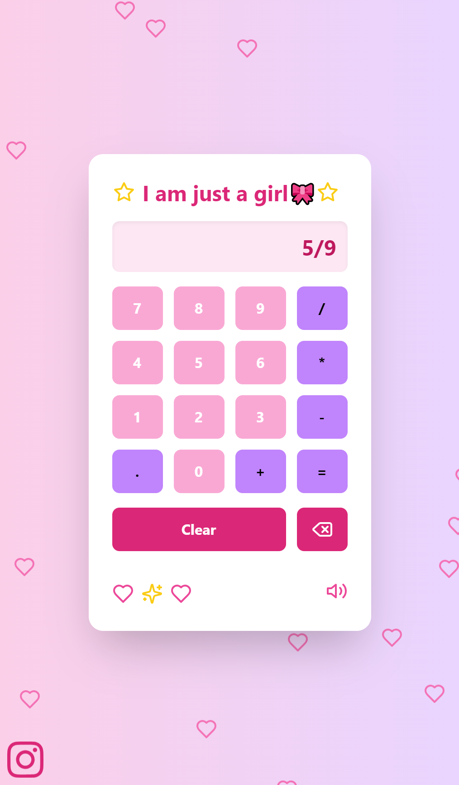

# 🎀 Cute Girly Calculator 🧮✨

Welcome to the most adorable calculator you've ever seen! This isn't just any calculator – it's a magical math companion for all the fabulous coders out there! 💖

## 🌟 Features

- 🦄 Performs basic arithmetic with a sprinkle of glitter
- 🎵 Cute sound effects that make math melodious
- 💗 Floating hearts background for extra charm
- ✨ Shimmering calculator border that sparkles like your personality
- 🌈 Soft, pastel color scheme to soothe your calculating soul

## 🚀 Getting Started

To bring this cuteness overload to your local machine:

1. Clone this repo

```
git clone
```

2. Install the dependencies

```
npm install
```

3. Start the development server

```
npm start
```

4. Open [http://localhost:3000](http://localhost:3000) in your browser and prepare for adorableness!

## 🛠️ Built With Love and

- React 💙
- Tailwind CSS 🎨
- Howler.js 🔊
- Lots of pink and sparkles ✨

## 📸 Screenshot



## 🤗 Contributing

Found a way to make this calculator even cuter? I'd love to see it! Feel free to:

1. Fork the repo
2. Create your feature branch (`git checkout -b feature/MoreSparkles`)
3. Commit your changes (`git commit -m 'Add some sparkles'`)
4. Push to the branch (`git push origin feature/MoreSparkles`)
5. Open a pull request (share the cuteness!)

## 🙏 Acknowledgments

- Hat tip to all the amazing developers who make coding cute and fun!
- Inspired by all things pink, fluffy, and mathematical 🧸

---

Remember, in the world of coding, you can always `count` on being cute! Happy calculating! 🎊
